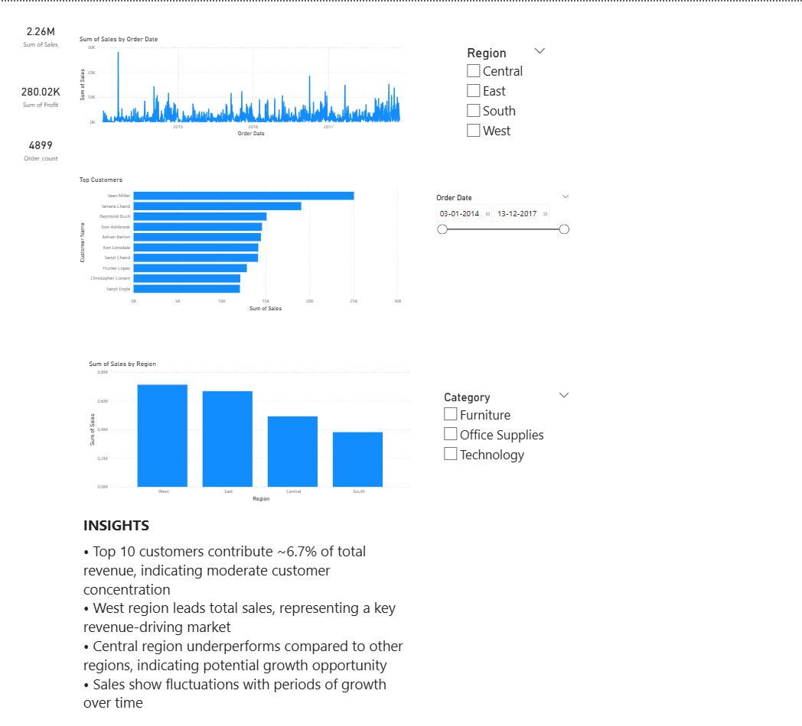

# 📊 E-Commerce Sales Analysis

## 🔍 Overview

This project presents an end-to-end analysis of an e-commerce dataset using **SQL, Python (Pandas), and Power BI**.
The goal is to extract meaningful insights from sales data, identify trends, and support data-driven decision-making.

---

## 🛠️ Tools & Technologies

* **SQL (PostgreSQL)** – Data querying and transformation
* **Python (Pandas, NumPy, Matplotlib)** – Data analysis and visualization
* **Power BI** – Interactive dashboard and reporting

---

## 📁 Project Structure

```
ecommerce-analysis/
│
├── ecommerce_analysis.ipynb          # Python analysis
├── ecommerce_analysis_queries.sql    # SQL queries
├── ecommerce_dashboard.pbix          # Power BI dashboard
├── Superstore-dataset.csv            # Dataset
├── README.md
└── images/
    └── dashboard.png                # Dashboard preview
```

---

## 📊 Dashboard Preview



---

## 📌 Key Analysis Performed

### 🔹 SQL

* Daily and monthly sales analysis
* Top customers identification
* Regional performance analysis
* Customer ranking using window functions
* Running totals and sales comparisons
* Customer contribution to total revenue

### 🔹 Python (Pandas)

* Data cleaning and preprocessing
* Feature engineering (date, month, year)
* Sales aggregation and grouping
* Customer and category analysis
* Data visualization (trends, distributions)

### 🔹 Power BI

* KPI cards (Sales, Profit, Orders)
* Sales trend visualization
* Top customers analysis
* Regional performance dashboard
* Interactive filters (Date, Region, Category)

---

## 📈 Key Insights

* **Top customer contributes ~1% of total revenue**, indicating a broad customer base
* **West region generates the highest sales**
* **Sales show fluctuations over time**, suggesting seasonal or promotional impacts
* **Certain regions and categories underperform**, highlighting optimization opportunities

---

## 🚀 Conclusion

This project demonstrates a complete data analysis workflow, combining **SQL, Python, and Power BI** to deliver actionable business insights.
It is designed as a **portfolio-ready project** for data analyst roles.

---

## 📬 Author

**Vinay**
